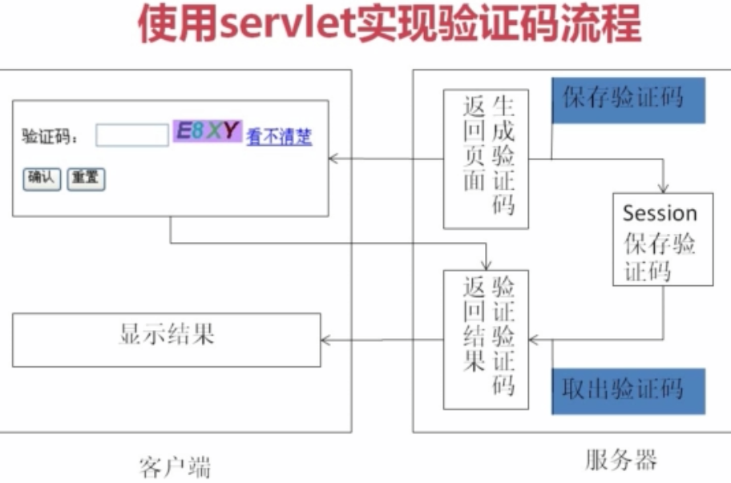
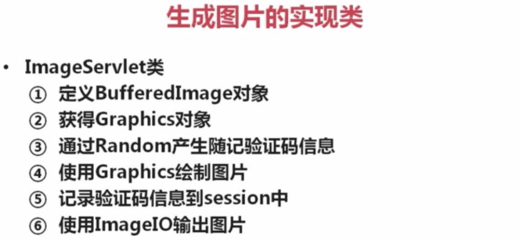
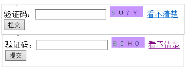
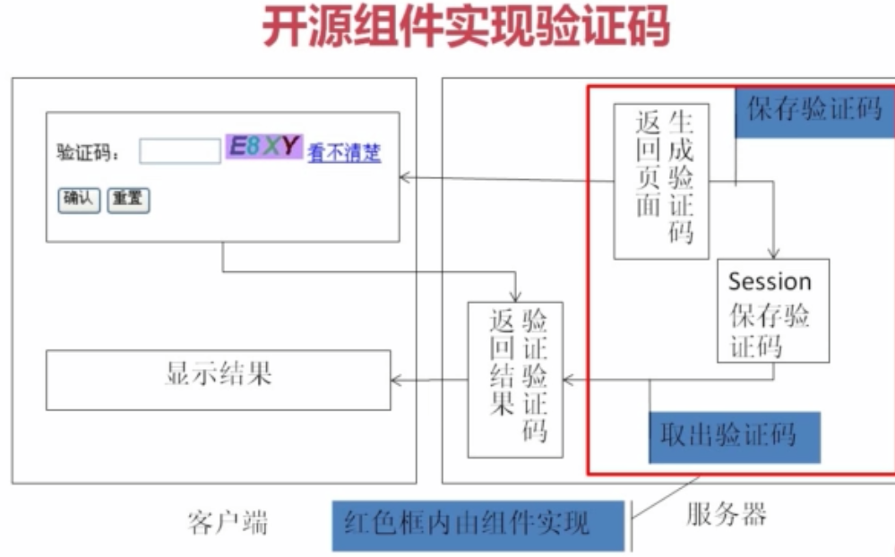
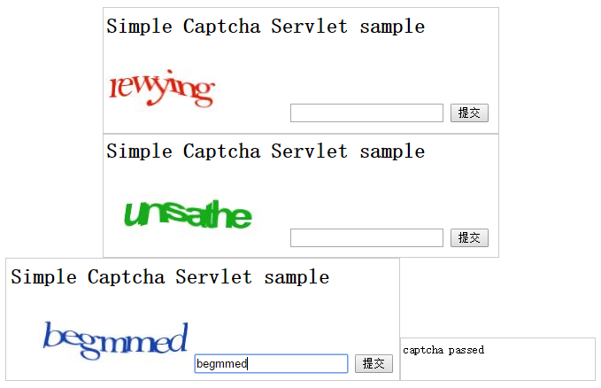
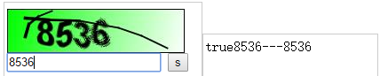
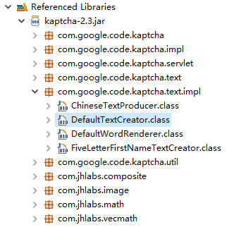
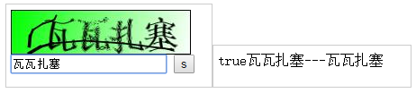
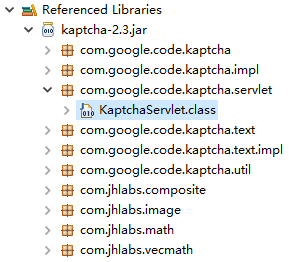
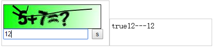

# Java实现验证码制作
## 前言
* 相信大家对验证码并不会陌生，无论是申请账号还是某些情况下登录时都会要求输入验证码。经过统计，验证码一次验证就成功通过的概率是90%，并不高，那么很多人对于这种降低用户体验度的设计肯定会怀疑他的必要性，但黑格尔说过：凡是合乎理性的东西都是现实的；凡是现实的东西都是合乎理性的。接下来我们来了解一下验证码。
* 验证码是一种区别用户是计算机还是人的公共全自动程序，他被用于防止恶意破解密码、刷票、论坛灌水，防止黑客通过暴力破解方式不断地登录，应用于银行、社区、论坛、投票系统等等。
* 废话不多说我们来看看我已知的用Java实现验证码的四种方式。
## Photoshop实现验证码
* 该方法是实现逻辑最简单的，但效率、安全性极其不高
### 实现效果


### 实现步骤：
* 用photoshop制作出验证码图片，矩形图片上可有必要的英文字母、数字或中文(如上)
* 将图片显示在swing控件中或是jsp页面中
* 在代码中为每张图片匹配上相应的验证码字符串
* 在提交时获取组件或文本框中的字符串与每张图片的字符串用equals()方法进行比较
### 总结
* 缺憾就是制作验证码图片的过程太费时，实现方法极low，极不推荐这样实现，下面的方法将越来越高效美观相对安全。
## 基于Javaweb实现验证码
* 这里讲Java Web，Servlet下的验证码实现，实现起来逻辑还是很清晰的。



* 省去较简单的实现代码，我们先从前台关键代码说起,当我们点击"看不清"时，验证码图片会进行一个刷新，会调用一个JavaScript函数用于重新设置图片路径来更换图片，请看下面代码，代码中<%=request.getContextPath()%>是为了解决相对路径的问题，可返回站点的根路径，而/servlet/ImageServlet是一个整体，指向的就是ImageServlet这个servlet，为什么要在之前加个/servlet呢，因为我们在web.xml中做了配置映射，可理解为换了个更长的名称。接着看下面JavaScript函数，可能有些人会有疑问，为什么获取一个当前时间然后加在路径最后呢，其实这是为了解决浏览器缓存的问题，就是当触发了ImageServlet后虽然验证码图片换了但缓存还没变显示出来的验证码图片不变的问题，借助每时每刻时间不同可以让浏览器缓存失效。
```javascript
<script type="text/javascript">
  function reloadCode(){
   var time = new Date().getTime();
   document.getElementById("imagecode").src="<%=request.getContextPath() %>/servlet/ImageServlet?d="+time;
  } 
</script>
```
* 下面是web.xml中的关键配置信息：
```xml
<servlet>
<servlet-name>ImageServlet</servlet-name>
<servlet-class>me.checkcode.servlet.ImageServlet</servlet-class>
</servlet>
<servlet-mapping>
<servlet-name>ImageServlet</servlet-name>
<url-pattern>/servlet/ImageServlet</url-pattern>
</servlet-mapping>
```
* 然后我们看关键的ImageServlet是怎么生成图片的：



```xml
<servlet>
    <servlet-name>ImageServlet</servlet-name>
    <servlet-class>com.muke.ImageServlet</servlet-class>
</servlet>
<servlet>
    <servlet-name>LoginServlet</servlet-name>
    <servlet-class>com.muke.LoginServlet</servlet-class>
</servlet>
<servlet-mapping>
    <servlet-name>ImageServlet</servlet-name>
    <url-pattern>/servlet/ImageServlet</url-pattern>
</servlet-mapping>
<servlet-mapping>
    <servlet-name>LoginServlet</servlet-name>
    <url-pattern>/servlet/LoginServlet</url-pattern>
</servlet-mapping>
```
* 如果要更生动的描述这种验证码是怎么样来实现的，那么就一个字“画”，听上去和第一种方法类似，还是比较low，但是用代码来自动“画”出验证码效率绝对翻了无数倍。我们来看上述代码，首先实例化了一个BufferedImage对象bi，bi是用来画出那张验证码图片的，然后用bi得到一支画笔g，用g画出了实体的矩形背景，接着用简单的逻辑通过画笔g调用Java中常用的drawString()方法在矩形上画出验证码字符，同时将字符串依次加入StringBuffer可变字符串对象中，最后存入jsp内置对象session中以便提交验证码后的比对，为了显示出验证码，我们还需将生成验证码图片以某种图片格式写入ImageIO流。
* 在LoginServlet中可以看出，获取刚刚ImageServlet存入session的字符串就可以进行与验证码提交框中字符串的比对了,可以把字符串都变为小写或大写做一个忽略大小写的处理。
* 下面是实现图例：



## 开源组件Jcaptcha实现验证码



### 实现简介
* 用开源组件Jcaptcha实现，与Spring组合使用可产生多种形式的验证码，JCaptcha 即为Java版本的 CAPTCHA 项目，其是一个开源项目，支持生成图形和声音版的验证码，在生成声音版的验证码时，需要使用到 FreeTTS。而CAPTCHA 全称 Completely Automated Public Turing Test to Tell Computers and Humans Apart，最早作为卡内基梅隆大学的一个科研项目，用于生成一个人类容易通过而计算机难以通过的测试，目前广泛应用于网络应用，用于阻止机器人发布垃圾信息。目前，JCaptcha 官方网站显示有 2.0 版本，但二进制版只有 1.0 版可供下载。
### jar包准备
* JCaptcha 项目在实现中，还引用了 commons-collections 和 commons-logging 两个开源项目，再加上 JCaptcha 本身的实现，我们共需要三个包，具体信息如下：
* jcaptcha-2.0-all.jarcommons-logging-1.1.1.jarcommons-collections-3.2.jar
### web.xml关键配置：
* 除配置了Jcaptcha组件的具体class路径外，还配置了SubmitActionServlet这个用于比对验证码的servlet，并且都为二者做了映射，可理解为换了名字，分别为/jcaptcha.jpg和/submit.action调用组件或servlet时直接用这个映射名即可。
```xml
<servlet>
    <servlet-name>jcaptcha</servlet-name>
    <servlet-class>com.octo.captcha.module.servlet.image.SimpleImageCaptchaServlet</servlet-class>
</servlet>
<servlet>
    <servlet-name>submit</servlet-name>
    <servlet-class>com.octo.captcha.module.servlet.image.sample.SubmitActionServlet</servlet-class>
</servlet>
<servlet-mapping>
    <servlet-name>jcaptcha</servlet-name>
    <url-pattern>/jcaptcha.jpg</url-pattern>
</servlet-mapping>
<servlet-mapping>
    <servlet-name>submit</servlet-name>
    <url-pattern>/submit.action</url-pattern>
</servlet-mapping>
```
### SubmitActionServlet实现
* 由于导入了jcaptcha的组件包，所以直接调用其中封装好的方法SimpleImageCaptchaServlet.validateResponse(request, userCaptchaResponse)来判断验证码中的信息是否与提交的匹配，而不需要去考虑具体的实现过程。
```java
public class SubmitActionServlet extends HttpServlet {
	private static final long serialVersionUID = 1L;

	protected void doPost(HttpServletRequest request, HttpServletResponse response)
			throws ServletException, IOException {
		String userCaptchaResponse = request.getParameter("japtcha");
		boolean captchaPassed = SimpleImageCaptchaServlet.validateResponse(request, userCaptchaResponse);
		if (captchaPassed)
			response.getWriter().write("captcha passed");
		else {
			response.getWriter().write("captcha failed");
		}
		response.getWriter().write("<br/><a href='index.jsp'>Try again</a>");
	}
}
```
### 前端调用
```xml
<html>
    <body>
        <h>Simple Captcha Servlet sample</h>
        <form action="submit.action" method="post">
             <input type="text" name="japtcha" value="" />
            <input type="submit"/>
        </form>
    </body>
</html>
```
### 实现图例



## 开源组件kaptcha实现验证码
* 同样使用kaptcha需要下载其jar组件包，kaptcha 是一个非常实用的验证码生成工具。有了它，你可以生成各种样式的验证码，因为它是可配置的。kaptcha工作的原理是调用 com.google.code.kaptcha.servlet.KaptchaServlet（可以看出他是谷歌的一个开源项目），生成一个图片。同时将生成的验证码字符串放到 HttpSession中。
* 使用kaptcha可以方便的配置：
验证码的字体验证码字体的大小验证码字体的字体颜色验证码内容的范围(数字，字母，中文汉字！)验证码图片的大小，边框，边框粗细，边框颜色验证码的干扰线(可以自己继承com.google.code.kaptcha.NoiseProducer写一个自定义的干扰线)验证码的样式(鱼眼样式、3D、普通模糊……当然也可以继承com.google.code.kaptcha.GimpyEngine自定义样式)
* 对kaptcha的配置信息同样的是放在了[web.xml](kaptcha/WebRoot/WEB-INF/web.xml)中：<init-param>标签中即初始化的配置信息
### 前台调用
* 验证码图片的路径用了映射名randomcode.jpg，点击事件onclick()调用了JavaScript函数，JavaScript函数中同样的用当前时间使浏览器缓存失效来刷新验证码图片。
```html
<html>
<head>
<meta http-equiv="Content-Type" content="text/html; charset=UTF-">
<title>randomcode</title>
<script type="text/javascript">
    function changeR(node){
    // 用于点击时产生不同的验证码
    node.src = "randomcode.jpg?time="+new Date().getTime() ; 
    }
</script>
</head>
<body>
    
    <form action="check.jsp">
        <input type="text" name="r">
        <input type="submit" value="s">
    </form> 
</body>
</html>
```
### 验证码的比对check.jsp
* 通过(String) session.getAttribute(com.google.code.kaptcha.Constants.KAPTCHA_SESSION_KEY);得到验证码图片中字符串信息。
```html
<html>
<head>
<meta http-equiv="Content-Type" content="text/html; charset=UTF-">
<title>check</title>
</head>
<body>
    <%
    // 检查是否是正确的验证码
    String k = (String) session
    .getAttribute(com.google.code.kaptcha.Constants.KAPTCHA_SESSION_KEY);
    String str = request.getParameter("r");
    if (k.equals(str))
    out.print("true");
    out.print(k + "---" + str);
    %>
</body>
</html>
```
### 实现图例



* 可以发现我们的验证码变得越来越来丰富多彩了，但是还停留在一个只验证英文字母和数字的阶段，那么还能不能玩点高端的呢，答案是肯定的。接下来我们来看一下中文验证码和算术运算验证码怎么实现。都只需基于以上kaptcha的使用进行修改即可。

### 中文验证码的实现



* 首先我们找到kaptcha.jar包下有个DefaultTextCreator.class字节码文件，顾名思义，他是来产生验证码中文本的一个类，我们可以通过自己实现一个继承于他的类，并通过配置来使用自己的实现类来使验证码中的文本变为中文。经过如下反编译后得到的类我们可以看到其是那样实现的，其中的getText()函数用于产生getConfig()配置器将要渲染的验证码文本，所以我们只需继承配置类并实现文本产生接口后重写getText()方法即可。
```java
public String getText() {
    int length = getConfig().getTextProducerCharLength();
    // char[] charS = getConfig().getTextProducerCharString();

    String[] s = new String[] { "慕","课","网","教","程","验","证","码","实","例" };

    Random rand = new Random();
    StringBuffer sb = new StringBuffer();
    for (int i = 0; i < length; i++) {
        int ind = rand.nextInt(s.length);
        sb.append(s[ind]);
    }
    return sb.toString();
}
```
* 在[ChineseText.java](kaptcha/src/ChineseText.java)类中，程序只需执行getText()中的代码，原来代码写到了getText1()中，不执行，大家可以做一个比较。
* 最后一步就是去web.xml中改文本实现类的值，使组件调用自己写的那个类产生中文验证码
```xml
<init-param>
    <description>文本实现类</description>
    <param-name>kaptcha.textproducer.impl</param-name>
    <param-value>ChineseText</param-value>
</init-param>
```
#### 实现图例



### 算数运算验证码的实现
* 和上述中文验证码相同，我们需要通过继承类和接口来实现自己的类，并改写其中的函数，然后通过改配置信息来使组件调用自己实现的类从而实现验证码形式的多样化。



* KaptchaServlet字节码文件经过反编译后的代码如下：
```java
import javax.imageio.ImageIO;
import javax.servlet.Servlet;
import javax.servlet.ServletConfig;
import javax.servlet.ServletException;
import javax.servlet.ServletOutputStream;
import javax.servlet.http.HttpServlet;
import javax.servlet.http.HttpServletRequest;
import javax.servlet.http.HttpServletResponse;
import java.awt.image.BufferedImage;
import java.io.IOException;
import java.util.Enumeration;

public class KaptchaServlet extends HttpServlet implements Servlet {
    private Properties props = new Properties();
    private Producer kaptchaProducer = null;
    private String sessionKeyValue = null;

    public void init(ServletConfig conf)
            throws ServletException {
        super.init(conf);
        ImageIO.setUseCache(false);
        Enumeration<?> initParams = conf.getInitParameterNames();
        while (initParams.hasMoreElements()) {
            String key = (String) initParams.nextElement();
            String value = conf.getInitParameter(key);
            this.props.put(key, value);
        }
        Config config = new Config(this.props);
        this.kaptchaProducer = config.getProducerImpl();
        this.sessionKeyValue = config.getSessionKey();
    }

    public void doGet(HttpServletRequest req, HttpServletResponse resp)
            throws ServletException, IOException {
        resp.setDateHeader("Expires", L);
        resp.setHeader("Cache-Control", "no-store, no-cache, must-revalidate");
        resp.addHeader("Cache-Control", "post-check=, pre-check=");
        resp.setHeader("Pragma", "no-cache");
        resp.setContentType("image/jpeg");
        String capText = this.kaptchaProducer.createText();
        req.getSession().setAttribute(this.sessionKeyValue, capText);
        BufferedImage bi = this.kaptchaProducer.createImage(capText);
        ServletOutputStream out = resp.getOutputStream();
        ImageIO.write(bi, "jpg", out);
        try {
            out.flush();
        } finally {
            out.close();
        }
    }
}
```

* 我们可以自己实现[KaptchaServlet.java](kaptcha/src/KaptchaServlet.java),在原来的字节码文件上增加了实现加法验证码的逻辑，通过比对即可发现。
* 我们还需在web.xml开头进行更改配置使组件来调用自己实现的servlet：
```xml
<servlet-name>Kaptcha</servlet-name>
<servlet-class>KaptchaServlet</servlet-class>
```
#### 实现图例



## 总结
* 这里只是简单实现了验证码，但要用到商业项目上还是远远不够的，验证码想要不被破解还要加上各种加密算法，即使这样，也可以随处搜索到某某验证码被破解的情况。在网络上有一个地下数据库，里面存储的是我们的个人信息，那些信息都是一条条整理好的，这十分可怕，但这样一个数据库是客观存在的，验证码作为保护账户密码的重要一环，已变得越来越不安全，因为个人信息的泄露，别人掌握了你足够的信息就可以对你实行诈骗，其中验证码是重要一环，近日就有一毕业生被骗取验证码后，几个小时内所有财富都被转走的事件发生。所以请保护好你的验证码，不要轻易泄露给他人。
* 当然我们也不会坐以待毙，目前的验证码种类繁多也越来越难以破解，像语音识别、面部识别这些都是耳熟能详的就不多说了。
* 这里我们引入一个验证码“新”概念：双因素认证。
* 双因素认证是一种采用时间同步技术的系统，采用了基于时间、事件和密钥三变量而产生的一次性密码来代替传统的静态密码。每个动态密码卡都有一个唯一的密钥，该密钥同时存放在服务器端，每次认证时动态密码卡与服务器分别根据同样的密钥，同样的随机参数（时间、事件）和同样的算法计算了认证的动态密码，从而确保密码的一致性，从而实现了用户的认证。因每次认证时的随机参数不同，所以每次产生的动态密码也不同。由于每次计算时参数的随机性保证了每次密码的不可预测性，从而在最基本的密码认证这一环节保证了系统的安全性。解决因口令欺诈而导致的重大损失，防止恶意入侵者或人为破坏，解决由口令泄密导致的入侵问题。
* 简单来说，双因素身份认证就是通过你所知道再加上你所能拥有的这二个要素组合到一起才能发挥作用的身份认证系统。例如，在ATM上取款的银行卡就是一个双因素认证机制的例子，需要知道取款密码和银行卡这二个要素结合才能使用。目前主流的双因素认证系统是基于时间同步型，市场占有率高的有DKEY双因素认证系统、RSA双因素认证系统等，由于DKEY增加对短信密码认证及短信+令牌混合认证支持，相比RSA，DKEY双因素认证系统更具竞争力。